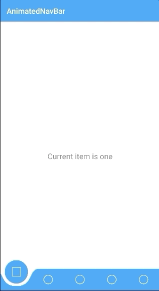

# Animated Bottom Navigation Bar
[ ](https://bintray.com/kadahlin/maven/animatednavbar/_latestVersion)
[](https://travis-ci.org/kadahlin/AnimatedNavBar)



An animated version of a bottom navigational bar that follows material design guidelines. Icons / colors are customizable 
to fit your app's specific theme. [AnimatedVectorDrawable][1]'s are supported for animating the selected icon. 

## How to use

Start by adding the Jcenter repository to your root build.gradle
```kotlin
    allprojects {
        repositories {
            jcenter()
        }
    }
```
Add the library dependency to your specific module's build.gradle file.

```kotlin
implementation("com.kyledahlin:animatednavbar:1.0.1")
```

**Create a menu xml resource**

Under src/main/res/xml create a new xml resource file to hold your nav bar menu. 3-5 items are recommended as per Material guidelines,
 with a minimum of 2 and a maximum of 6 supported.

- nav_bar_menu.xml
```xml
<?xml version="1.0" encoding="utf-8"?>
<navbaritems xmlns:android="http://schemas.android.com/apk/res/android">

    <navbaritem
            icon="@drawable/static_drawable_one"
            animated_icon="@drawable/animated_drawable_one"
            android:id="@+id/nav_bar_one"/>

    <navbaritem
            icon="@drawable/static_drawable_two"
            animated_icon="@drawable/animated_drawable_two"
            android:id="@+id/nav_bar_two"/>

    ...

</navbaritems>
```

Attributes to set:
- *icon* : the drawable to be displayed when the item is not selected
- *animated_icon* : the drawable to be displayed when the item is selected. If this file is a valid [AnimatedVectorDrawable][1] it will be animated.
- *id* : the android id related to this particular item 

The component can then be directly inserted into any layout xml file. 

```xml
<com.kyledahlin.animatednavbar.AnimatedBottomNavigationBar 
    android:id="@+id/animated_nav_bar"
    app:navBarColor="@color/yourNavBarColor"
    app:navBarMenu="@xml/nav_bar_menu"
    app:navBarSelectedColor="@color/yourSelectedColor" />
```

Attributes to set:
- *navBarMenu*: The xml res
- *navBarColor*: the color that will be used for the layout of the AnimatedBottomNavigationBar. By default this is android.R.color.white
- *navBarSelectedColor*: the background color of the animated selection circle. By default this will match the navBarColor

A listener can be set on the `AnimatedBottomNavigationBar` to receive updates when the user selects a new ID

```kotlin
animated_nav_bar.setIdSelectedListener { id ->
    when(id) {
        R.id.nav_bar_one -> handleIdOne()
        R.id.nav_bar_two -> handleIdTwo()
        ...
    }
}
```

### More information
A full integration can be found in the app folder.

## License

    Copyright 2019 Kyle Dahlin

    Licensed under the Apache License, Version 2.0 (the "License");
    you may not use this file except in compliance with the License.
    You may obtain a copy of the License at

       http://www.apache.org/licenses/LICENSE-2.0

    Unless required by applicable law or agreed to in writing, software
    distributed under the License is distributed on an "AS IS" BASIS,
    WITHOUT WARRANTIES OR CONDITIONS OF ANY KIND, either express or implied.
    See the License for the specific language governing permissions and
    limitations under the License.

[1]: https://developer.android.com/reference/android/graphics/drawable/AnimatedVectorDrawable